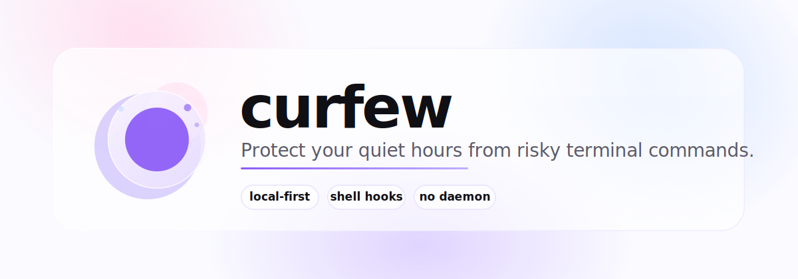
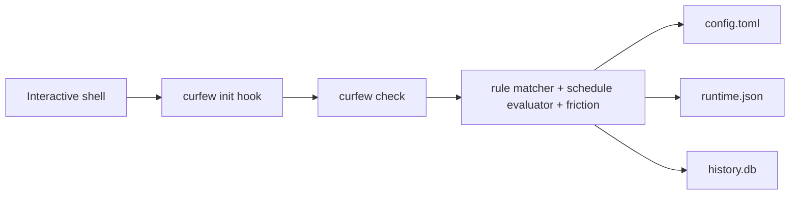

<div align="center">
  <picture>
    <source media="(prefers-color-scheme: dark)" srcset="assets/logo-dark.svg">
    
  </picture>

  <h1>curfew</h1>

  <p><strong>a local-first terminal curfew for your quiet hours</strong></p>

  <p>
    <a href="https://github.com/iamrajjoshi/curfew/actions/workflows/ci.yml"></a>
    <a href="https://iamrajjoshi.github.io/curfew/guide/"></a>
    <a href="https://github.com/iamrajjoshi/curfew/releases"></a>
    
    
    
    <a href="LICENSE"></a>
  </p>
</div>

`curfew` intercepts interactive terminal commands during your configured quiet hours, blocks or friction-gates risky commands, and keeps a local history of whether you actually respected your own bedtime.

It is a single Go binary, uses managed shell hooks instead of a daemon, stores everything on disk locally, and ships with both a CLI and a Bubble Tea TUI.

## Features

- local-first enforcement with zero network calls
- shell integration for `zsh`, `bash`, and `fish`
- configurable quiet hours with weekday overrides, warning windows, hard stops, and snoozes
- simple first-match-wins command rules with exact, prefix, and glob-style matching
- override friction presets plus custom tiered flows using prompt, wait, passphrase, math, or combined challenges
- six-tab terminal UI for dashboard, schedule, rules, override behavior, history, and stats
- SQLite-backed adherence history plus lightweight JSON runtime state for fast shell checks

## Install

Homebrew:

```bash
brew install iamrajjoshi/tap/curfew
```

Install with Go:

```bash
go install github.com/iamrajjoshi/curfew@latest
```

Build from source:

```bash
git clone git@github.com:iamrajjoshi/curfew.git
cd curfew
go build ./...
```

Current scope is macOS and Linux. Interactive shell enforcement is the primary path today; PATH shims for non-interactive/script contexts can come later.

## Quick Start

Run the first-time setup flow:

```bash
curfew
```

Install the managed shell hook:

```bash
curfew install --shell zsh
```

Reload your shell and verify things are wired up:

```bash
exec zsh
curfew doctor
curfew status
```

From there, the hook will call `curfew check <cmd>` before executing interactive commands. Commands that match your rules during quiet hours will be blocked, warned, or friction-gated depending on the active tier.

## Default Config

`curfew` writes its config to `~/.config/curfew/config.toml`.

```toml
[schedule]
timezone = "auto"

[schedule.default]
bedtime = "23:00"
wake = "07:00"

[schedule.overrides.friday]
bedtime = "00:00"
wake = "09:00"

[schedule.overrides.saturday]
bedtime = "00:00"
wake = "09:00"

[grace]
warning_window = "30m"
hard_stop_after = "01:00"
snooze_max_per_night = 2
snooze_duration = "15m"

[override]
preset = "medium"
method = "passphrase"
passphrase = "i am choosing to break my own rule"
wait_seconds = 60
math_difficulty = "medium"

[rules]
default_action = "allow"

[[rules.rule]]
pattern = "claude"
action = "block"

[[rules.rule]]
pattern = "cursor-agent"
action = "block"

[[rules.rule]]
pattern = "aider*"
action = "block"

[[rules.rule]]
pattern = "git push*"
action = "warn"

[[rules.rule]]
pattern = "git commit*"
action = "warn"

[[rules.rule]]
pattern = "terraform apply*"
action = "block"

[[rules.rule]]
pattern = "npm run deploy*"
action = "block"

[[rules.rule]]
pattern = "kubectl apply*"
action = "block"

[allowlist]
always = ["ls", "cd", "cat", "less", "man", "tldr", "curfew", "exit", "clear"]

[logging]
retain_days = 90
```

## Commands

| Command | What it does |
| --- | --- |
| `curfew` | launches first-run setup or the TUI dashboard |
| `curfew status` | prints current curfew state |
| `curfew start` | force-enables curfew for the current session |
| `curfew stop` | disables curfew for the rest of the current session with friction |
| `curfew snooze [15m]` | buys time, up to the nightly limit |
| `curfew skip tonight` | disables tonight's session with friction |
| `curfew rules` | opens the rules tab in the TUI |
| `curfew rules add/rm/list` | manages rules from the CLI |
| `curfew config` | opens the schedule/config flow |
| `curfew history --days 7` | prints recent adherence history |
| `curfew stats --days 30` | prints streaks and rollups |
| `curfew check <cmd>` | internal command used by the shell hook |
| `curfew install` | appends a managed init block to your shell rc file |
| `curfew init <shell>` | prints the shell integration snippet |
| `curfew doctor` | shows hook and path diagnostics |
| `curfew version` / `curfew --version` | prints the current binary version |

## TUI

The Bubble Tea interface currently includes:

- `Dashboard`: live status, nightly sparkline, and runtime actions for snooze, force-enable, stop, and skip
- `Schedule`: editable weekday schedule, warning window, hard stop, and snooze settings
- `Rules`: editable rule list, allowlist/default action settings, and live command probing against the draft config
- `Override`: editable presets and custom tier configuration
- `History`: read-only adherence list with `7/30/90` day ranges
- `Stats`: read-only streak and aggregate views

Useful keys:

- `tab` / `shift-tab` to switch tabs
- `ctrl+s` to save the draft config
- `ctrl+r` to discard the unsaved draft and reload config from disk
- `r` to refresh runtime-derived data without discarding local edits
- `q` to quit

## How It Works



The shell hook stays intentionally small. It delegates to `curfew check`, and the Go binary owns the actual policy evaluation:

- config lives in `~/.config/curfew/config.toml`
- hot-path runtime state lives in `~/.local/state/curfew/runtime.json`
- long-term events and nightly rollups live in `~/.local/share/curfew/history.db`

There is no background daemon. Each shell check is on-demand and re-evaluates against wall-clock time, config, and runtime state.

## Privacy

`curfew` is fully local-first:

- no telemetry
- no accounts
- no background service
- no network calls

`curfew doctor` will tell you exactly which files it is using.

## Development

```bash
go test ./...
go build ./...
go run github.com/goreleaser/goreleaser/v2@latest release --snapshot --clean --skip=publish
```

Website work lives in `website/`:

```bash
cd website
pnpm install
pnpm dev
pnpm build
```

The repo includes unit, integration, TUI-model, and end-to-end coverage. CI runs the Go test and build matrix on macOS and Linux.

Tagged releases `vX.Y.Z` publish GitHub release artifacts and update the Homebrew formula in `iamrajjoshi/homebrew-tap`.

## Roadmap

- richer history drill-in and heatmap views
- optional PATH shims for non-interactive/script enforcement
- deeper shell-hook hardening and PTY coverage
- packaging polish for additional distribution channels

## Contributing

Contributions are welcome. See [CONTRIBUTING.md](CONTRIBUTING.md) for local setup, testing expectations, and PR guidance.

## License

[MIT](LICENSE)
